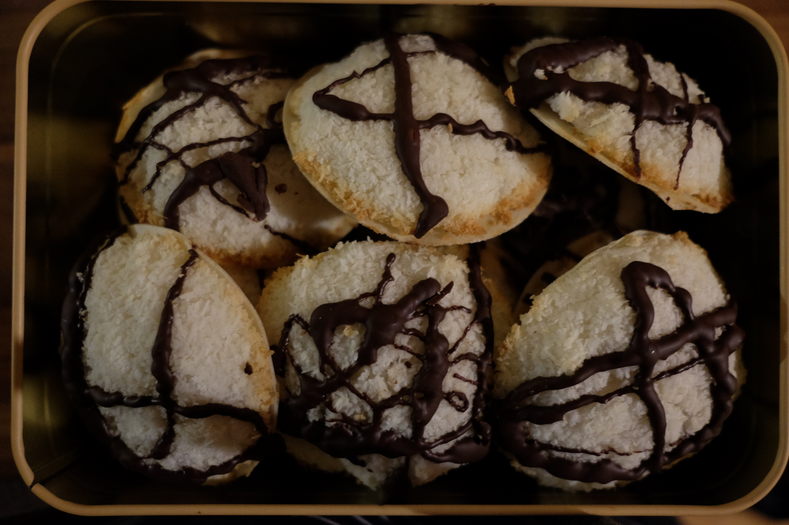

Lust auf Hummus? Na dann back' doch gleich noch Kokosmakronen! Hier kommt noch eine tolle Verwertung für das Wasser aus dem Kichererbsenglas. Ich habe beim Backen 7cm große Oblaten genutzt, die mir bei der Kokosbombe aber deutlich zu groß sind.

### Zutaten (für 17 Stück)
---
* 17 Oblaten (7 cm)
* 100 ml Kichererbsenwasser (etwas weniger als ein abgetropftes Glas)
* 0,5 TL Backpulver
* 150 g Puderzucker
* 200 g Kokosflocken
---

### Zubereitung
Für das Aquafaba (= veganer Eischnee) das Kichererbsenwasser mit dem Backpulver auf höchster Stufe mit dem Handrührgerät aufschlagen. Sobald es weiß und schaumig ist, portionsweise den Puderzucker dazugeben. Weiter mixen, bis die Masse dickflüssig ist und nur noch zäh vom Rührer läuft. 

Nach und nach mit einem Teigschaber unter die Kokosflocken rühren, bis ein gut zusammenklebender Teig entsteht. Es kann sein, dass nicht das ganze Aquafaba benötigt wird. Falls der Teig nicht gut klebt und bröselt, einen Schluck Wasser zugeben. 

Je 2 EL Teig zu einer Halbkugel formen und auf eine Oblate drücken. 

Bei 150°C 10-15 Minuten backen. Die Makronen sollten nicht braun werden. 